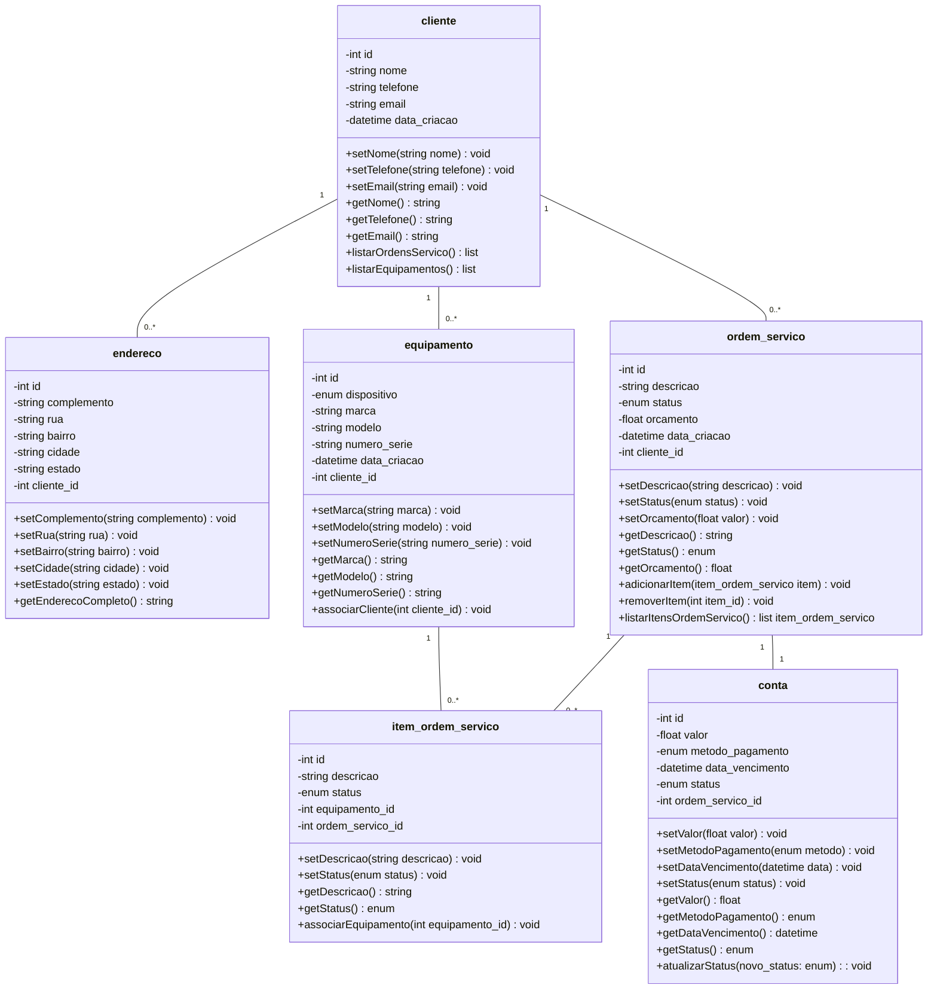

# Modelo Conceitual

## Diagrama de Classes e Entidade-Relacionaento

### Descrição das entidades

| Entidade               | Descrição                                                                                                                                                                                                                                                                                                                           |
| ---------------------- | ----------------------------------------------------------------------------------------------------------------------------------------------------------------------------------------------------------------------------------------------------------------------------------------------------------------------------------- |
| **cliente**            | Representa o cliente que solicita os serviços. Possui atributos: `id`, `nome`, `telefone`, `email`, `data_criacao`. Métodos: `setNome()`, `setTelefone()`, `setEmail()`, `getNome()`, `getTelefone()`, `getEmail()`, `listarOrdensServico()`, `listarEquipamentos()`.                                                               |
| **endereco**           | Representa o endereço de um cliente. Atributos: `id`, `complemento`, `rua`, `bairro`, `cidade`, `estado`, `pessoa_id`. Métodos: `setComplemento()`, `setRua()`, `setBairro()`, `setCidade()`, `setEstado()`, `getEnderecoCompleto()`.                                                                                               |
| **equipamento**        | Equipamento do cliente que será consertado. Atributos: `id`, `dispositivo`, `marca`, `modelo`, `numero_serie`, `data_criacao`, `pessoa_id`. Métodos: `setMarca()`, `setModelo()`, `setNumeroSerie()`, `getMarca()`, `getModelo()`, `getNumeroSerie()`, `associarCliente()`.                                                         |
| **ordem_servico**      | Representa uma ordem de serviço solicitada por um cliente. Atributos: `id`, `descricao`, `status`, `orcamento`, `data_criacao`, `pessoa_id`. Métodos: `setDescricao()`, `setStatus()`, `setOrcamento()`, `getDescricao()`, `getStatus()`, `getOrcamento()`, `adicionarItem()`, `removerItem()`, `listarItensOrdemServico()`.        |
| **item_ordem_servico** | Itens da ordem de serviço, representando partes do serviço realizadas em um equipamento. Atributos: `id`, `descricao`, `status`, `equipamento_id`, `ordem_servico_id`. Métodos: `setDescricao()`, `setStatus()`, `getDescricao()`, `getStatus()`, `associarEquipamento()`.                                                          |
| **conta**              | Representa a cobrança de uma ordem de serviço. Atributos: `id`, `valor`, `metodo_pagamento`, `data_vencimento`, `status`, `ordem_servico_id`. Métodos: `setValor()`, `setMetodoPagamento()`, `setDataVencimento()`, `setStatus()`, `getValor()`, `getMetodoPagamento()`, `getDataVencimento()`, `getStatus()`, `atualizarStatus()`. |

### Descrição de enums

| Enum            | Descrição                                               |
| --------------- | ------------------------------------------------------- |
| statusOS        | ABERTA, EM_ANDAMENTO, FINALIZADA ou CANCELADA.          |
| statusItemOS    | PENDENTE, EM_EXECUCAO ou CONCLUIDO.                     |
| dispositivo     | NOTEBOOK, SMARTPHONE, TABLET, DESKTOP ou OUTRO.         |
| metodoPagamento | DINHEIRO, CARTAO_CREDITO, CARTAO_DEBITO, PIX ou BOLETO. |
| statusConta     | PENDENTE, PAGA, ATRASADA ou CANCELADA.                  |
